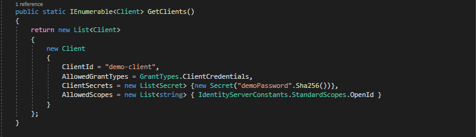
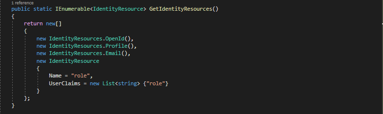
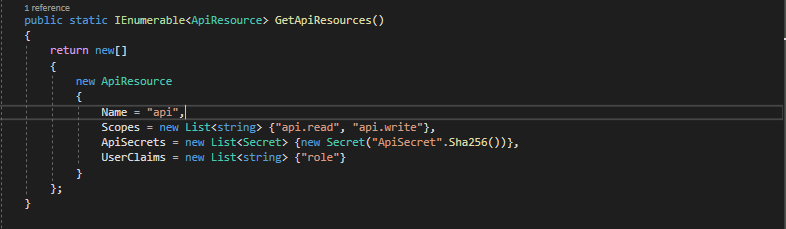
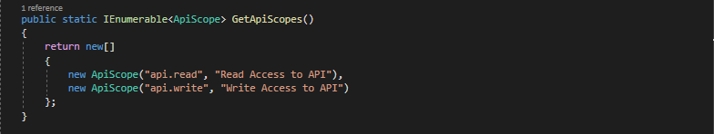
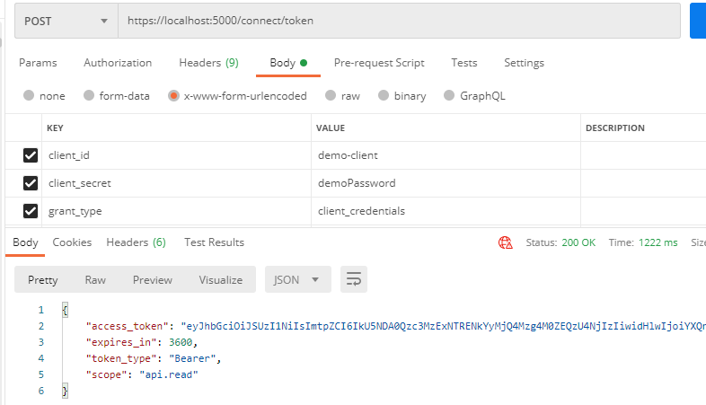
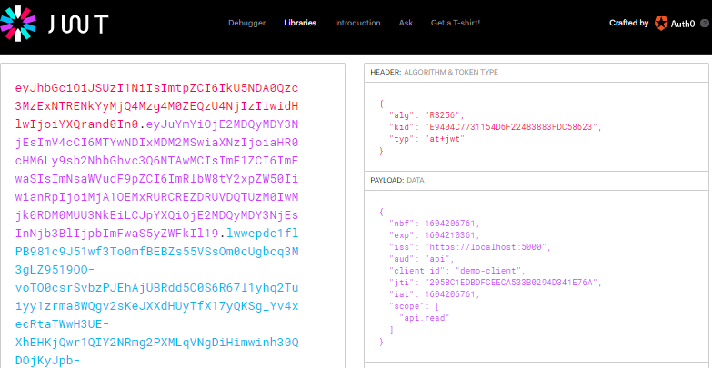

# Integrate identityserver4 and dotnet-core 3.1

# Used Technologies

1. dotnetcore 3.1
2. IdentityServer4

# Quick Started

1. Checkout the code.
2. Open a cmd inside the folder where you cloned the code.
3. Run 'dotnet run --project ./Identity.csproj' or 'dotnet run'
4. Open a browser and type 'https://localhost:5000'

# Getting Started

Create new Asp.Net Core Web Application project using VisualStudio2019 IDE. After that select empty template and make sure the ‘Configure for HTTPS’ is ticked. 
Same can be achieved by executing the follwing command 'dotnet run web'

Remove IIS profile from launchSettings.json file. Then change the 'applicationUrl' to https://localhost:5000.

Install IdentityServer4 package.

After that installation, IdentityServer need to be added to application by modifying the ConfigureServices method in Startup.cs file.

Above of code will register the IdentityServer4 in Dependancy Injection Container.

Additionally, IdentityServer need to be added to the request pipeline by modifying the Configure method in Startup.cs file. By doing so IdentityServer start handling the OAuth and OpenId Connect requests.

Next step is to add configurations related to Users, Clients, IdentityResources etc. For that new folder 'Configuration' need to be added to the solution at the root level. Then create a class 'Config.cs' inside that folder.

Clients

Let IdentityServrer know which clients have access to it. Here the Client Credentials grant type is used. Allowed scopes defines the allowed list of permissions which the client can request from IdentityServer. Please change the password to a strong one.

Identity Resources.

Identity resource allows client to view subset of claims about user. Here first 3 are standard OpenId Connect scopes while the last one is a custom identity resource 'role'.

Api Resources,

An Api resource defines one Api that IdentityServer protects.

Api Scopes

An API scope defines individual authorization level on an API that client application can request. In this case scopes are api.read and api.write.

Users.

Add following namespaces in-order to get rid of the errors.

Finally modify the ConfigureServices method in Startup.cs file. Here In-Memory store is used to register resources. This is fine for development purpose. Use persisting store for production scenarios. 

That's it, time for testing.

First visit the discovery document (https://localhost:5000/.well-known/openid-configuration) and check the 'scopes_supported' and 'claims_supported'. Supported scopes include 'api.read', 'api.write' and 'role' while supported claims contains the custom claim 'role' as well.

Next try to grab an access token through postman by filling the values shown in the image. 

Finally decode the token to see the claims using jwt.io.

Now create a web api project from visual studio IDE or using following command 'dotnet web api'. Add the following package to the project.

Then add following to api's ConfigureServices method.

Update the Configure method by adding following.

Finally add [Authorize] attribute to one of the api end point. After that the end point only be accessible through a request with an access token generated by the dentityServer. 

