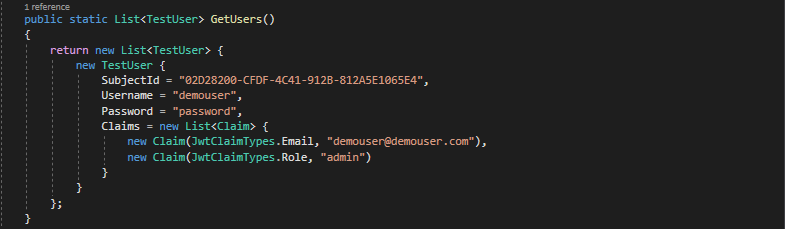

# Adding custom claims to accesstoken using identityserver4 and dotnet-core 3.1

# Used Technologies

1. dotnetcore 3.1
2. IdentityServer4

# Quick Started

1. Checkout the code.
2. Open a cmd inside the folder where you cloned the code.
3. Run 'dotnet run --project ./Identity.csproj' or 'dotnet run'
4. Open a browser and type 'http://localhost:5000'

# Getting Started

Configure Identity Server

Create new project using VisualStudio2019 IDE.

Select Asp.Net Core Web Application.

Give a name and select a location. After that select empty template and remove tick ‘Configure for HTTPS’.

Remove IIS profile from launchSettings.json file.

Install IdentityServer4 package.

After that installation, IdentityServer need to be added to application by modifying the ConfigureServices method in Startup.cs file.

Additionally, IdentityServer need to be added to the request pipeline by modifying the Configure method in Startup.cs file.

Next step is to add configurations related to Users, Clients, IdentityResources etc. For that new folder 'Configuration' need to be added to the solution at the root level. Then create a class 'Config.cs' inside that folder.

Now add Identity Resources.

Add Users.

Add client.

Add following namespaces in-order to get rid of the errors.

After that we need to modify the ConfigureServices method in Startup.cs file.

